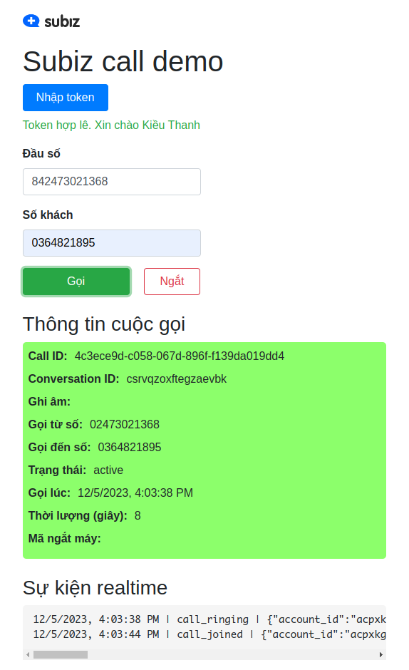

# Tích hợp tổng đài Subiz

Subiz cung cấp SDK để bạn có thể thực hiện cuộc gọi trên browser
```
const SubizWebPhone = require('@subiz/wsclient/webphone.js')

let access_token = 'YOUR SUBIZ PERSONAL ACCESS TOKEN HERE';
let webphone = new SubizWebPhone(access_token)
webphone.makeCall('036411111', '0247123456')
```

Trước khi có thể sử dụng được SDK bạn cần:
* Một tài khoản Subiz ([Đăng ký dùng thử miễn phí 30 ngày](https://app.subiz.com.vn/register))
* Tạo được access token cho tài khoản này
* Một đầu số tổng đài đã đấu nối thành công vào Subiz

Để có thể sử dụng SDK hiệu quả, bạn nên dành thời gian tìm hiểu qua các khái niệm chung của Subiz
### Khái niệm chung
#### User
Khách hàng của doanh nghiệp. User bao gồm các thông tin cơ bản: `họ tên`, `email`, `SĐT`, `ảnh đại diện`. Ngoài ra còn có thể có những thông tùy chọn riêng nhu cầu của doanh nghiệp như: `ngày đăng ký`, `giới tính`, `số CMTND`, ...

Khi có người nhắn tin vào Facebook fanpage, Zalo OA hay gọi vào số tổng đài của doanh nghiệp. Subiz tự tạo một user tương ứng. User này có thể chuyển qua CRM riêng của doanh nghiệp bằng webhook. Một bản ghi user sẽ có dạng như sau:

```js
{
  id: "usrvmnntjcngcoxnbuowf",
  attributes: [
    { key: "fullname", text: "Châu Anh" },
    { key: "email", text: "chauanh@gmail.com" },
    { key: "last_login", datetime: "2023-12-04T13:05:28Z" },
    { key: "avatar_url", text: "https://vcdn.subiz-cdn.com/file/firvonruijswrmiwoddd" },
  ],
  lead_owners: ["agriviekoixdhmwpcc"],
  created: 1701136956337,
  updated: 1701695131849,
}
```

#### Agent
Một thành viên của nội bộ doanh nghiệp, có thể là sale, marketing, trực page hay quản lý.

Mỗi agent sẽ được cấp một tài khoản (email/password) để sử dụng
Subiz. Agent có thể đăng nhập vào Subiz để tạo access_token cá nhân
của mình, access_token này sau đó có thể dùng để gọi API.

#### Conversation - Hội thoại
Một cuộc trò chuyện (cuộc gọi) với khách hàng. Hội thoại sẽ ghi lại thời điểm xảy ra cuộc gọi, số tổng đài, số của khách, ghi âm và nhiều thông số của cuộc gọi.

Nếu có ID của hội thoại (giả sử là csrvqjiilytjxgffey), có thể dùng API để lấy thông tin về cuộc gọi.
```
GET https://api.subiz.com.vn/4.0/accounts/accid/conversations/csrvqjiilytjxgffey?x-access-token=access-token
```
Dưới đây là chi tiết của một cuộc gọi cụ thể (kết quả trả về của request GET trên)
```js
{
  "account_id": "acpxkgumile",
  "id": "csrvqjiilytjxgffey", // định danh cho hội thoại - cuộc gọi
  "created": 1701678775101, // thời gian tạo
  "members": [ // danh sách những người tham gia hội thoại (bao gồm khách, agent trả lời, giám sát viên, agent được transfer, ...)
    {
      "type": "agent",
      "id": "agqedvggzqocgkzfrk",
      "membership": "active",
      "joined_at": 1701678775303,
    },
    {
      "type": "user",
      "id": "usrlvtwuwieqxnkwhccts",
      "membership": "active",
      "call_answered": 1701678777397 // thời điểm khách nhấc máy
    }
  ],
  "ended": 1701678992911,
  "state": "ended",
  "touchpoint": { // nơi xảy ra cuộc gọi
    "id": "19006008",
    "channel": "call",
    "source": "842473021368"
  },
  "call": { // thông tin chi tiết cuộc gọi
    "started": 1701678775080,
    "answered": 1701678777323,
    "ended": 1701678992886,
    "to_number": "19006008",
    "from_number": "842473021368",
    "direction": "outbound", // chiều gọi: oubound - agent gọi đi, inbound - khách gọi tới
    "initial_by_phone_device": "phrjromwwuzyylzzhws",
    "duration_sec": 215,
    "status": "ended",
    "recorded_audio": { // file ghi âm
      "name": "2023-12-04_acpxkgumifu_csrvqjiilytjxgffey_recorded.wav",
      "type": "audio/x-wav",
      "size": 3452844,
      "md5": "bebf7148fecf94c0e59843373ff88434",
      "url": "https://vcdn.subiz-cdn.com/file/firvqjjkjkwfiomjzaji", // url tới file ghi âm (public với những ai có đường link)
      "duration": 215,
    }
  },
}
```

### Sử dụng SDK
#### Cài đặt SDK
```
npm --save @subiz/wsclient
```

#### Thực hiện cuộc gọi đi
1. Tạo webphone
2. Gọi `webphone.makeCall`

```js
const SubizWebPhone = require('@subiz/wsclient/webphone.js')
let access_token = 'YOUR SUBIZ PERSONAL ACCESS TOKEN HERE';
let fromNumber = '0247123456' // số tổng đài
let toNumber = '036411111' // số của khách
let webphone = new SubizWebPhone(access_token)

webphone.makeCall(toNumber, fromNumber)
```

##### Tự động đảo số khi gọi lỗi
Nếu bạn có nhiều đầu số, bạn có thể truyền một mảng vào tham số fromNumber. Ví dụ:
```js
webphone.makeCall('03412312', ['0247000001', '0247000002', '0247000003', '0247000004'])
```

Webphone sẽ thực hiện cuộc gọi đầu tiên bằng đầu số `02470000001`, nếu cuộc gọi thất bại do nhà mạng từ chối hoặc do lỗi tín hiệu. Webphone sẽ lần lượt thử gọi bằng các đầu số sau đó `0247000002`, `0247000003`, ... Quá trình này sẽ kết thúc khi một trong những điều kiện sau xảy ra:
1. Cuộc gọi diễn ra thành công (đầu bên kia nhấc máy)
2. Agent chủ động bấm ngắt cuộc gọi
3. Đã hết đầu số để thử


#### Lắng nghe sự kiện của cuộc gọi
Bạn có thể gọi hàm `onEvent` để nhận các sự kiện realtime của cuộc gọi ví dụ: đổ chuông (`call_ringing`), kết thúc (`call_ended`)
```js
const SubizWebPhone = require('@subiz/wsclient/webphone.js')
let access_token = 'YOUR SUBIZ PERSONAL ACCESS TOKEN HERE';
let webphone = new SubizWebPhone(access_token)

webphone.onEvent(function (ev) { console.log("EVENT", ev) })
```

Các sự kiện sẽ có dạng như bên dưới
```
12/5/2023, 3:08:47 PM | { "type": "call_ringing", "data": {"call_info": {"started":1701763727793,"to_number":"0364821895","from_number":"02473021368","direction":"outbound","status":"dialing","device_id":"webrtcfxfqunbgcxiakdlrtrme","member_id":"agqmwfyuehpuzpehmv","call_id":"dc5a26f3-691b-21d3-5ad3-7cfd319fadb4"}}}
12/5/2023, 3:08:54 PM | { "type": "call_joined", "data": {"call_info": {"conversation_id":"csrvqyzdnelvzyanls","started":1701763727793,"answered":1701763734787,"to_number":"0364821895","from_number":"02473021368","direction":"outbound","status":"active","device_id":"webrtcfxfqunbgcxiakdlrtrme","member_id":"agqmwfyuehpuzpehmv","call_id":"dc5a26f3-691b-21d3-5ad3-7cfd319fadb4"}}}
12/5/2023, 3:09:00 PM | { "type": "call_ended", "data": {"call_info": {"conversation_id":"csrvqyzdnelvzyanls","started":1701763727793,"answered":1701763734787,"ended":1701763740189,"to_number":"0364821895","from_number":"02473021368","direction":"outbound","hangup_code":"Terminated","status":"ended","device_id":"webrtcfxfqunbgcxiakdlrtrme","member_id":"agqmwfyuehpuzpehmv","call_id":"dc5a26f3-691b-21d3-5ad3-7cfd319fadb4"}}}
```

#### Lấy file ghi âm cuộc gọi
Sau khi cuộc gọi kết thúc, bạn có thể tải file ghi âm về (lưu ý bạn cần bật chức năng ghi âm cho đầu số trong giao diện cài đặt của Subiz).
```
let call = webphone.getCall(callid)
if (!call) return Promise.resolve(null)
let convoid = call.conversation_id
fetch(`https://api.subiz.com.vn/4.0/accounts/${accid}/conversations/${convoid}?x-access-token=${access_token}`).then((response) => {
	return response.json()
}).then(convo => {
  console.log("RECORDED URL", convo.call.recorded_audio.url)
})
```

Lưu ý: Ngay sau khi Subiz gửi cho bạn sự kiện kết thúc cuộc gọi. File ghi âm có thể chưa được trả về ngay. Subiz cần khoảng một vài giây để upload file tùy vào độ dài của cuộc gọi. Bạn nên có cơ chế retry để đảm bảo lấy được được URL của file ghi âm.

#### API liệt kê cuộc gọi theo một khoảng thời gian

Bạn cần xác định khoảng thời gian cần liệt kê (`hour = unix
second/3600`). Kết của trả ra sẽ chỉ là những hội thoại được tạo trong
khung giờ chỉ định

```
                           from_hour       to_hour
                              |              |
                              v              v
thời gian: 0 -----------------<<<<<<<<<<<<<<<<---------------> now
```
```
POST https://api.subiz.com.vn/4.0/report/call-ids?x-access-token={access_token}
{
  "created_hour_from": 472553,
  "created_hour_to": 472720,
  "limit": 20,
  "anchor": ""
}
```
Dữ liệu trả về mẫu

```
200 OK
{
  "anchor": "#csrvkdisxqqqgovmvr",
  "conversations": [
    {
      "id": "csrvrlqaidbkxjbgpg",
      "created": 1701832406382,
      "agent_sent_ids": [
        "agriviekoixdhmwpcc"
      ],
      "channel": "call",
      "channel_touchpoint": "842473021368"
    },
    {
      "id": "csrvrlpydmkrbpidcr",
      "created": 1701832388885,
      "agent_sent_ids": [
        "agpxkgycwccstrfptx"
      ],
      "channel": "call",
      "channel_touchpoint": "842473021368"
    },
	...
  ]
}
```

Ở request bạn có thể áp dụng thêm một số điều kiện như chiều của cuộc
gọi hoặc đầu số gọi ra. Ví dụ:
```
{
  "direction": "outbound",
  "phones": ["842473021368"],
  "created_hour_from": 472553,
  "created_hour_to": 472720,
}
```

Tham số `limit` và `anchor` dùng để phân trang kết quả trả về. Những cuộc
gọi trả về sẽ được sắp xếp theo thứ tự *giảm dần* theo thời gian tạo. Để
lấy trang kết quả tiếp theo, bạn lấy `anchor` của kết quả request
trước, lắp vào request tiếp theo. Đến khi `anchor` trả về là rỗng hoặc
danh sách cuộc gọi rỗng thì bạn đã lấy hết kết quả.

### hangup_code
Hangup code cho biết tại sao cuộc gọi kết thúc. Bạn có thể lấy hangup
code theo 2 cách
#### 1. Nghe sự kiện realtime có type là call_ended

```js
webphone.onEvent(function (ev) { console.log("EVENT", ev) })

{
  "type": "call_ended",
  "data": {
    "call_info": {
      "conversation_id": "csrvqyzdnelvzyanls",
      "started": 1701763727793,
      "answered": 1701763734787,
      "ended": 1701763740189,
      "to_number": "0364821895",
      "from_number": "02473021368",
      "direction": "outbound",
      "hangup_code": "cancel", <----------
      "status": "ended",
      "call_id": "dc5a26f3-691b-21d3-5ad3-7cfd319fadb4"
    }
  }
}
```

#### 2. Lấy thông tin cuộc gọi

```
GET
https://api.subiz.com.vn/4.0/accounts/accid/conversations/csrvqjiilytjxgffey?x-access-token=access-token

{
  "id": "csrvqyzdnelvzyanls",
  "state": "ended",
  "call_info": {
    "conversation_id": "csrvqyzdnelvzyanls",
    "started": 1701763727793,
    "answered": 1701763734787,
    "ended": 1701763740189,
    "to_number": "0364821895",
    "from_number": "02473021368",
    "direction": "outbound",
    "hangup_code": "cancel", <----------
    "status": "ended",
    "call_id": "dc5a26f3-691b-21d3-5ad3-7cfd319fadb4"
  }
}
```

#### Bảng mã hangup_code

| hangup code   |  Giải thích  |
|---|---|
|  <rỗng>  | Cuộc gọi diễn ra thành công hoặc cuộc gọi kết thúc theo kịch bản tự động |
| `busy`   |  Máy bận |
| `noanswer` | Khách không trả lời  |
| `congestion` |  Nghẽn mạng hoặc nhà mạng từ chối thực hiện cuộc gọi |
| `cancel` |  Người gọi hủy cuộc gọi  |
| `chanunavail` | số sai hoặc nhà mạng từ chối thực hiện cuộc gọi |
| *`Terminated` |  (sẽ xóa trong thời gian gần, thay bằng cancel) Người gọi hủy cuộc gọi  |

### Demo


Để chạy được bản demo, trước tiên bạn cần clone mã nguồn repository này
```sh
git clone https://github.com/subiz/demo-callcenter-sdk
```

Cài các thư viện cần thiết

```sh
npm i
```

Chạy server dev
```sh
npm run dev
```
```
> @subiz/callcenter-sdk@0.0.0 dev
> vite

The CJS build of Vite's Node API is deprecated. See https://vitejs.dev/guide/troubleshooting.html#vite-cjs-node-api-deprecated for more details.
Port 5173 is in use, trying another one...
Port 5174 is in use, trying another one...

  VITE v5.0.5  ready in 741 ms

  ➜  Local:   http://localhost:5173/
  ➜  Network: use --host to expose
  ➜  press h + enter to show help
4:00:48 PM [vite] page reload demo.html
```

Truy cập http://localhost:5173/demo.html để vào trang demo. Ở đây bạn cần nhập token trước khi có thể thực hiện cuộc gọi đi.

## API quản lý tài khoản
Phần này mô tả một số API giúp bạn tạo agent (sale), sinh access
token cho họ.
Trước khi sử dụng được những API này, bạn cần đảm bảo rằng mình là chủ
tài khoản, tiếp đó hãy xác định các thông số sau:
* `account id`: ID tài khoản của doanh nghiệp mình. Xem trong trang [Cài đặt](https://app.subiz.com.vn/settings/)
* `agent id`: ID của một agent cụ thể. Xem trong trang [Quản lý
  agent](https://app.subiz.com.vn/settings/agents). Khi click vào xem
  chi tiết từng agent, bạn có thể nhìn thấy ID của agent trên thanh
  địa chỉ của trình duyệt.

### Tạo agent mới
```
POST https://api.subiz.com.vn/4.0/accounts/<accid>/agents?x-access-token=..."

{
  "id": "new",
  "state": "active",
  "lang": "vi",
  "encrypted_password": "ZacHsYrA",
  "scopes": [
    "agent"
  ],
  "timezone": "+07:00",
  "fullname": "Mỹ Linh",
  "email": "linhlinh@test.com",
  "extension": null
}
```
Kết quả trả về có dạng

```js
{
  "id": "<agentid>",
  "account_id": "<accountid>",
  "fullname": "Mỹ Linh",
  "email": "linhlinh@subiz.com",
  "is_owner": false,
  "lang": "vi",
  "timezone": "+07:00",
  "state": "active",
  "password_changed": 1702010629876,
  "modified": 1702010629876,
  "type": "agent",
  "scopes": [
    "agent"
  ],
  "extension": 2008
}
```

### Tạo access token cho agent
Agent có thể tạo access token để tiện cho việc sử dụng API. Chủ doanh
nghiệp (account) có thể tạo access token cho bất kỳ agent nào sử dụng
api dưới đây
```
POST https://api.subiz.com.vn/4.0/accounts/<accid>/agents/<agentid>/apikeys?x-access-token=<access_token>

{
  "ttls": 0,
  "note": "Gọi tổng đài",
}
```

| Tham số   |  Giải thích  |
|---|---|
| `accid` | ID tài khoản của *doanh nghiệp* bạn (tránh nhầm với agent id của bạn) |
| `access_token` | Mã truy cập cá nhân của bạn |
| `agentid` | ID của bạn. Nếu bạn là chủ tài khoản và mong muốn tạo cho agent khác, bạn điền ID của agent đó vào |
| `ttls` | thời gian hợp lệ của token sau khi tạo (tính bằng giây). Nếu bạn truyền vào là 0 thì token sẽ không hết hạn. |
| `note` | một trường mô tả nhằm mục đích gợi nhớ để sau này bạn quản lý dễ hơn |

Ví dụ trả về sau khi gọi thành công
```js
200 OK
{
  "agent_id": "<agentid>",
  "client_id": "dashboard",
  "id": "airvsskgxgfdxzmstvqu",
  "kind": "agent",
  "refresh_token": "acpxkgumi_agqmwfyzpehmv_AKrtkgxgfdpjgrdfalfldjglzxmpkxcfgdkalfjahfj",
  "access_token": "acpxkgumi_agqmwfyzpehmv_AKrtkgxgfdpjgrdfalfldjglzxmpkxcfgdkalfjahfj",
  "scopes": [
    "all"
  ],
  "created": 1702010379903,
  "last_used": 1702010379903,
  "access_token_expired": 4855610379903,
  "access_token_generated": 1702010379903,
  "type": "apikey",
  "client_version": "v1.0.0",
  "note": "Gọi tổng đài"
}
```

Sau khi có access token bạn có thể thử lại bằng cách lấy access token
mới lắp vào request sau
```
GET https://api.subiz.com/4.0/me?x-access-token=...
```

Nếu trả ra thông tin của agent thì token bạn tạo ra là hợp lệ
